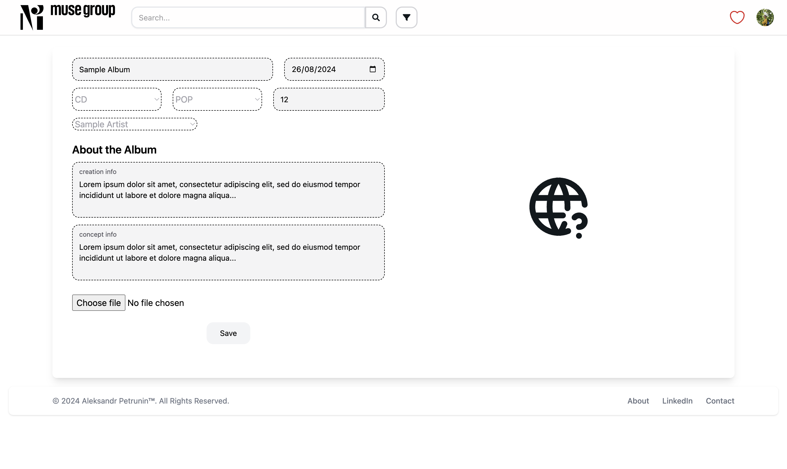
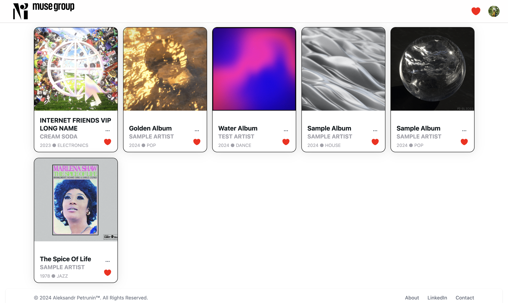

# Music Album Catalog

A responsive web application built with React.js that serves as a catalog for music albums. The application includes user authentication, album management, and search functionalities, with distinct roles for editors and visitors. Backend functionality is managed using a BaaS service like Supabase.

## Table of Contents

1. [Features](#features)
2. [Tech Stack](#tech-stack)
3. [Usage](#usage)
4. [Environment Variables](#environment-variables)
5. [Screenshots](#screenshots)
6. [Contact](#contact)

## Features

- **User Authentication**: Supports login and registration with role-based access (editor and visitor).
- **Album Catalog**: Paginated list of music albums with search and filter functionality.
- **Album Details Page**: View detailed information about a music album.
- **Album Management**: Editors can add, edit, delete or archive/publish albums.
- **Favorites**: Users can add albums to a favorites list and view them on a dedicated page.
- **Dark Theme Support**: Toggle between light and dark themes.

## Tech Stack

- **Frontend**: React.js, React Router, Zustand
- **Backend**: Supabase (BaaS)
- **Styling**: Tailwind CSS
- **Deployment**: AWS Amplify

## Usage

### Authentication

- Register as a new user or log in with an existing account
- visitor@gmail.com / redactor@gmail.com (11112222)
- Upon successful login, users can navigate to different sections of the app based on their role.

### Album Catalog

- The catalog page displays a list of music albums with pagination.
- Use the search bar and filters to narrow down the list of albums.

### Album Management (Editor Role)

- Editors can add new albums using the "Add Album" button.
- Newly added albums are stored in archive, publishing reveal them to everybody.
- To edit or delete an album, navigate to the album's details page or card context menu and use the provided options.

### Favorites

- Add albums to the favorites list by clicking the heart icon on the album cards.
- View your favorites on the dedicated "Favorites" page.

## Environment Variables

To run this project, you will need to add the following environment variables to your `.env` file:

- `VITE_REACT_APP_SUPABASE_URL`: The URL of your Supabase project.
- `VITE_REACT_APP_SUPABASE_ANON_KEY`: The anonymous public API key for your Supabase project.

## Screenshots

Here are some screenshots of the application:

- **Home Page**: 
- **Album Details**: 
- **Favorites Page**: 
- **Dark Mode**: 

Project Link: [https://github.com/yourusername/music-album-catalog](https://github.com/yourusername/music-album-catalog)
